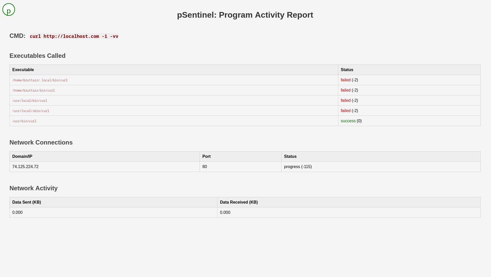

# pSentinel


A study project.

Simple `ptrace` based process monitor to analyse syscalls performed by a program in linux.

## Usage
```txt
Usage: psentinel [options...] [cmd] [args]

   -h, --help          Print help and exit
   -v, --version       Print program version and exit
   -f, --follow        Follow all the nested syscalls
   -o, --out           File path for html report. Defaults to 'report.html'

   cmd                 Executable to be monitored
   args                Additional arguments for cmd

```

**Sample `report.html` generated**



## Dev Setup

There is a Makefile for rescure

to get detailed make targets execute
```sh
make
# or
make help
```

Targets
```sh
make help           #  - Show all Makefile targets.
make test           #  - Run test
make build-prod     #  - Production build
make build-dev      #  - Debug build
make pre-commit     #  - Pre commit hooks
make clean          #  - Clean build dirs
```


## ToDos
- Test cases
- Cover arm architecture support
- The send and recv may not be accurate (only considering sendto and recvfrom syscalls)
- Consider intercepting dns queries
